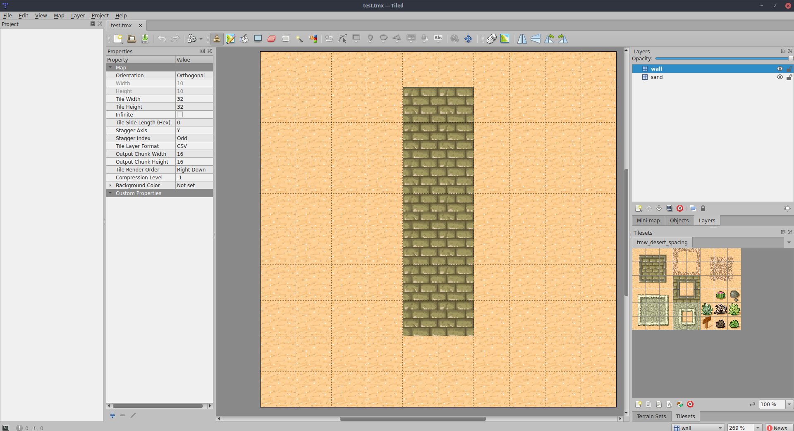

# Chronicles of Proxima

One thousand years after the Proxima Centauri colonalization, the human race felt into a dark age.
Chronicles of Proxima is set five thousands years after the beginning of the dark age, humans completally forgot the knowledge of the past, but they still have access to Gems, fragments of an ancient technology that they use to enhance their weapons and armor. They also reacts to some materials in magical ways allowing them to cast spells.

## Work in progress board game

Chronicles of Proxima was initially thought as a board game, this implementation has some differences from the orgiginal idea. Still, the gameplay is very similar. Right now the project is a work in progress, I just finished working on the basic dynamics of the gameplay. And I'm starting to work on the backend to allow multiplayer games. Then I'll work on the frontend.

## Installing and running the example

```
npm install
```
or
```
yarn
```
then to run test program
```
node src/test.js
```

## Game mechanics

### Base attributes
Every character or mob has the following attributes:
* **hp**: the amount of life of the player
* ~~**maxHp**: the maximum amount of life of the player~~ **//TODO**
* **mana**: the amount of mana of the player
* **maxMana**: the maximum amount of mana of the player
* **parry**:  a value used to define if the player is being hit
* **dodge**: a value used to define if the player is being hit
* **meleeDamage**: the amount of damage the player does using a melee weapon
* **spellPower**: the amount of damage the player does using a spell
* **rangeDamage**: the amount of damage the player does using a ranged weapon
* **hit**:  a value used to define if the player hits the target
* **actions**: the amount of actions the player can to each action
* **endTurnMana**: the amount of mana restored every end turn
* **speed**: the maximum speed of the player

### Modifiers

Modifiers are composed by:
* Attributes to modify (can be numbers or dice roll)
* startsAt: turn in which start to be effective
* expiresAt: turn in which stop to be effective, can be ∞

Modifiers can be permanent or temporary, so it should be considered in the calculation. In the following example you can see how I will write modifiers in this document.

E.g.
Rheon has the following modifiers:
* **0 parry [0 -> ∞]** from his base stats. [0 -> ∞] is the duration of the modifier (from turn 0 to the end)
* **+5 parry [1 -> 2]** from the spell he cast at turn 0, that starts from turn 1 and last for one turn
* **-1d3 parry [0 -> 1]** from the spell his enemy cast on him. (1d3 means one "three faces" dice)

### Calculating attributes

A character doesn't have fixed attributes, attributes are calculated each time, applying:
* all the modifiers of the character
* all the modifier of every piece of its gear.

that are active in the turn.

Here is how to calculate Rheon's parry at turn 0 (from previous example)
```
0 - 1d3 = 0 - 2 = -2
```

### Map

The maps in this implementation are created using the open source map editor *Tiled*.



The map is a grid of X * Y cells.

There are currently two kinds of blocks: normal and walls. The player cannot move through walls.

The player can move in every directions without cutting the edges of the walls and respecting her maxium speed.

### Turn

The turn has the following phases: 
1) Selecting the active player
2) The active player spend it's actions
3) When the active player has no actions left, repeat step 1. until all the players have spent all their available actions.
4) At the end of the turn calculate endTurn modifiers. (E.g endTurnMana)

### Actions

The available actions are:
* Move
* Attack: melee, range, spell 
* Spell attack
* Use friendly spell
* ~~Search~~ **//TODO**
* ~~Activate an item~~ **//TODO**

### Attacking

If the attack is melee, the attacker and the defender must be in the same cell.

If the attack is range or spell, the attacker and the defender must be in line of sight (see next section for more info) and the distance must be less then the maximum range distance.

A player hits the target if her hit roll is higher then the parry or the dodge of the target.

If the defender is hit, then the damage is calculated and inserted as an hp modifier [ x -> ∞ ] (where x is the turn), to the defender modifiers.

#### Calculating range and melee damage

A player always attack with all the equipped weapons. For example if Rheon range attack Agaroth, the damage is calculated summing all the rangeDamage modifiers (from his modifiers and the modifiers from his gear).

#### Calculating  spell damage

A player that cast a spell to attack has to select which spell to cast. Each spell has a specific damage modifier.
The total damage is the sum of the spell damage modier and all the spellPower modifiers (from his modifiers and the modifiers from his gear).

### Line of sight

One of the main differences between the board game and this implementation is the calculation of the line of sight. In the board game version the players use a ruler to check if there are any obstancles between the two entities. In this implementation I use a custom algorithm to check it, follow [this link](./docs/LOS.md) to discover more.

## Game example: LOG

```
Game starts
Active player is Theon
Theon cast Fire Armor on Theon using 5 mana.
        +5 on parry for 1 turn
        Calculation for Theon's hp
                Base stats: 10  () => 10
                Total: 10
Theon now has 10 mana left.
Theon cannot hit Rheon throught walls.
Active player is Rheon
Rheon cannot hit Theon throught walls.
Rheon moves -1, 0
Rheon is now in 3, 8
Rheon moves 0, -1
Rheon is now in 3, 7
Rheon tries to hit Theon.
        Calculation for Rheon's hit
                Base stats: 3   () => roll([...dices(1, 6)])
                Total: 3
        Calculation for Theon's dodge
                Total: 0
        Calculation for Theon's parry
                +5 on parry for 1 turn: 5       () => 5
                Total: 5
Rheon melee misses Theon rolling hit 3 against parry 5
Theon recovered 5 mana.
Rheon recovered 0 mana.
Next turn
Active player is Rheon
Rheon tries to hit Theon.
        Calculation for Rheon's hit
                Base stats: 5   () => roll([...dices(1, 6)])
                Total: 5
        Calculation for Theon's dodge
                Total: 0
        Calculation for Theon's parry
                Total: 0
Rheon melee hit Theon rolling hit 5 against parry 0
        Calculation for Rheon's meleeDamage
                Sword strike: 10        () => roll([...dices(3, 6)])
                Total: 10
Rheon does 10 melee damage to Theon.
Theon is dead.
Rheon cannot target Theon because Theon is dead
Rheon cannot target Theon because Theon is dead
Rheon recovered 0 mana.
Next turn
```