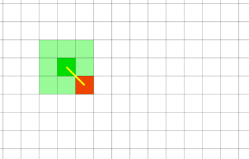
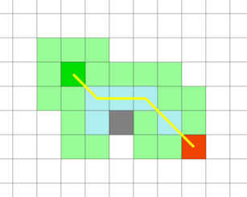
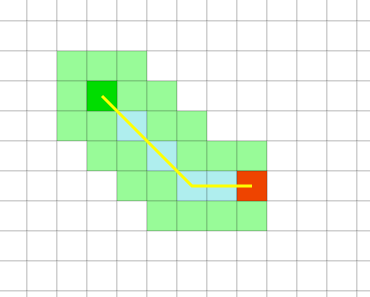
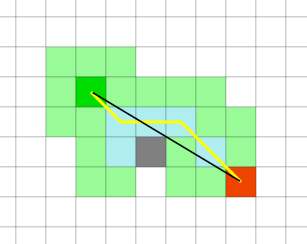
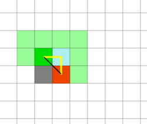

## Line of sight

In this implementation I use the following algorithm to check the line of sight.
* Use the Lee algorithm to find the fastest path with the wall between A and B **without crossing corners**: calculate in how many steps you reach B from A
* Use the Lee algorithm to find the fastest path without any wall between A and B: calculate in how many steps you reach B from A
* If the length is the same it means that there are now walls between A and B

This algorithm creates weird situations, but it's the best thing I thought to manage LOS. Here is an example of a weird situation.
Given the previous rules in this situation player A and B are NOT in line of sight.

Because if we calculate the steps without the wall are 1 less

But a similar situation like this

Has the same steps as the board without the walls

Even if using the ruler to connect A and B touches the wall in the same spot, like this:

The only difference is the angle in which the tangent of the wall hits the wall, but "in real life" the amount of sight doesn't change.

Right now I will not search for a better algorithm because I like it and I think is elegant enought.